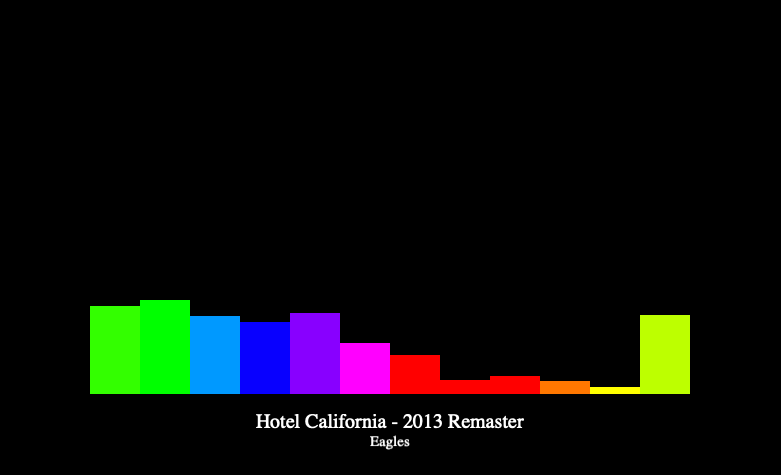

# Spotify Music Visualization

> <b>Project Description</b>

C++ music visualizer using Cinder/OpenGL for audio visualization. 
Live synced to Spotify through the Spotify API which provides user music information 
and analysis for each track. Live visualizer can handle pause/play, track switching/skipping,
etc. 
Custom displays are derived from Spotify's audio analysis for each song,
and display colors are calculated as RGB values corresponding to musical
pitches.  

*Current supported visualization styles: <b>bar chart visualizer</b>*

---
> <b>Usage</b>

*Make sure to [create a Spotify account](https://www.spotify.com/us/signup/) before using visualizer.*
1. Clone repository
2. Get Authorization Code: allow this application to access your currently playing information
   1. Log in to Spotify [here](http://tiny.cc/getspotifycode)
   2. Copy code from resulting webpage URL
3. Navigate to file include/core/spotify_information_retriever.h
   1. Paste retrieved code into authorization_code_ 
4. Open up Spotify, start playing music
5. Run visualizer!
---
> <b>Work in Progress!</b>

- Full Spotify login/authentication integration
- Add addition visualization types
- Smoother time sync between visualizer and currently playing Spotify audio
